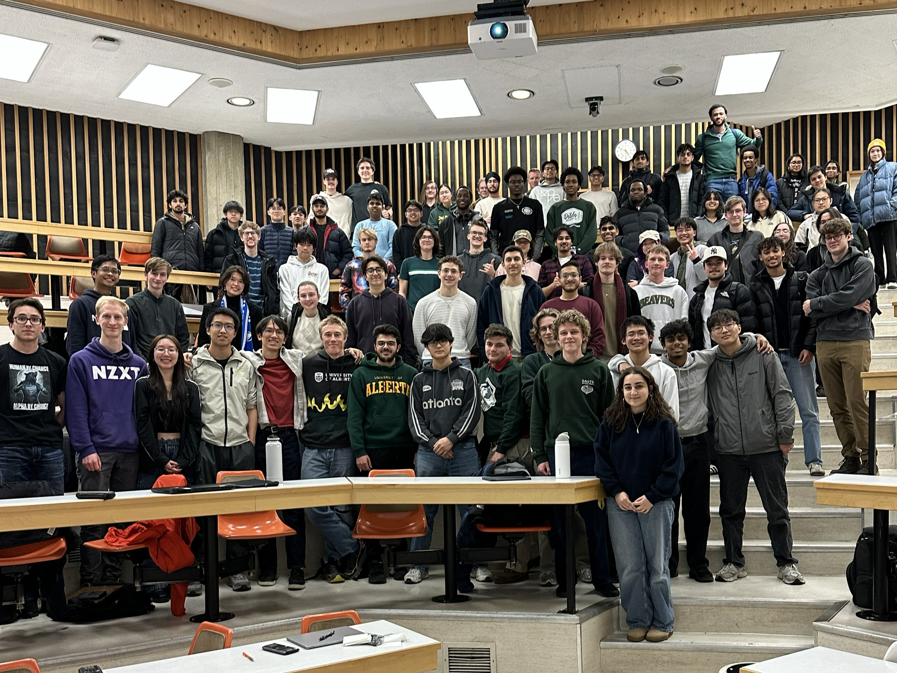

In 2025, the University of Alberta announced the launch of its first Mechatronics and Robotics Engineering program. The new undergraduate program combines the high-demand fields of robotics, electrical, computer, and mechanical engineering. 

The first of their kind, the inaugural cohort of mechatronics students started in the 2025-2026 year. From establishing our official discipline club, bringing our unmistakable energy to GEER Week, and forging lasting industry connections, we are proud to be the pioneers of MCTR at the U of A.

