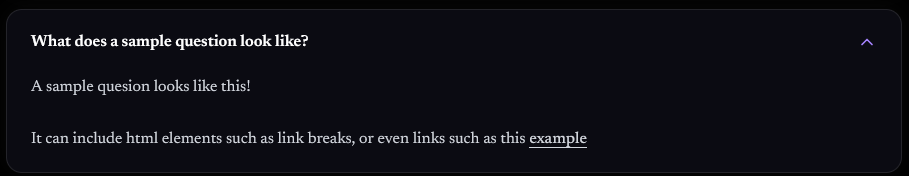
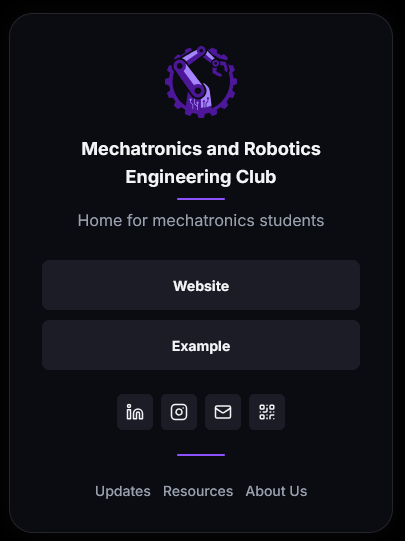
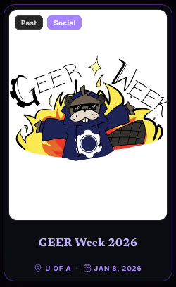
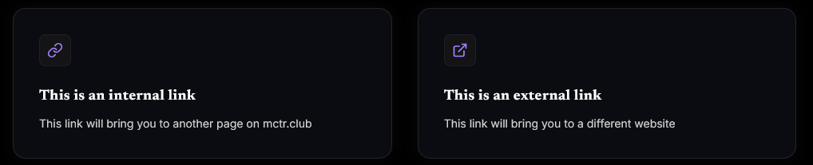

The purpose of the article is to provide any interested contributors as well as any future maintainers of the mechatronics website a guide on how the website is structured. 

## General
- An intro on how to work with markdown files can be found on this website's [markdown guide](/resources/markdown-guide)
- When including images, do not use HEIC assets (typically created by iPhones) on this website. Convert to a more widely supported like `.png` or `.jpg` first.

## Contributing workflow

If interested in contributing to the site, please make a request to a website administrator at `mctrclub@ualberta.ca` to be added to the `ualberta-mctr` GitHub organization and the `Web Team` GitHub team. 

The general workflow for working on the site is as follows:
1. Pull Latest `main`
2. Create Branch
3. Push & PR
4. Review Cloudflare Preview
5. Merge

### Branches
For new branches please follow the examples below
```
content/add-event-page
feature/create-new-
fix/broken-event-filters
```
The prefixes have the following usage: 
- `content/` - This is for adding new events, updates, in the `/src/content` directories, and for making changes to the values in the `/src/settings` json files
- `feature/` - This is for adding new elements to the website. Generally any PR that changes a `.astro`, `.js`, or `.ts` file falls in this cateogry
- `fix/` - This is for any bug fixes, typos, etc. 

A new branch can be created with the following command
```bash
git switch -c new-branch-name
```

### Pull requests
When work on a particular branch is complete, open a PR targeting `main`. 

### Review and merge
Get another member of the club to review the site, open the preview link to verify the site looks good. After confirming everything is as expected, merge the branch into main and delete the branch. 

## Pages
Below is a section detailing how to update the content contained within each area of the website

### Homepage
**Carousel**

As part of the hero layout of the homepage, there is a carousel of images. These images can be updated by changing the images stored in the `/arc/assets/carousel` folder of the site. Supported image formats include `.jpg`, `.png`, `.gif`, and `.webp`. The image names do not matter, however numbering can help with displaying the images in the carousel in a specific order.

**FAQ**

The FAQ section of the homepage can be edited by changing the information stored inside of `/src/settings/faq.json`. 
```json
[
  {
    "question": "What does a sample question look like?",
    "answer": "A sample question looks like this! <br><br> It can include html elements such as line breaks, or even links such as this <a href=\"https://example.com\">example</a>"
  }
]
```
For each entry, the text will be parsed as html. This allows for line breaks `<br>`, links `<a>`, or other html tags to be included within the FAQ section. Do note that for external links, it is vital to prefix with `https://` otherwise it will not work. 


Output for the example json snippet above

**Calendar**

The home page also contains a calendar displaying the club room schedule. The schedule can be updated by updating the events in the `Club Room Schedule` calendar which is controlled by the `mctrclub@ualberta.ca` email. The website will update automatically based on changes made in google calendar after a client side refresh. 

### About
The main code for this page lives at `/src/pages/about/index.astro`. The section of interest is the `<TeamGrid>` tags, these can be added or removed based on how any different types of roles there are on the board at a given time. Each `<TeamGrid />` tag requires that a json file be passed using the folloing syntax `<TeamGrid {...json}/>`. 

The json files passed into the astro component follows the following structure. These json files are stored at `/src/settings/`.
```json
{
  "title": "Section Title",
  "enableModal": false,
  "members": [
    {
      "name": "Member 1",
      "role": "role1",
      "image": "member1.jpg",
      "about": ""
    },
    {
      "name": "Member 2",
      "role": "role2",
      "image": "member2.jpg",
      "about": ""
    }
  ]
}
```
`title` defines the text that will be shown in the section heading at the top of the grid. `enableModel` is a boolean value that determines if the content written inside of `about` for each member will be displayed. Images for the about page should all be stored in `/src/assets`

### Links
This section of the website is meant to act as a linktree replacement. The only file of interest for this section is `/src/settings/settings.json`. To add or remove links, locate the following section of the json file

```json
  "Links": {
    "Website": "/",
    "Example": "https://example.com"
  }
```
For each entry, the text before the `:` is the text that will be displayed on the website. Do note that for external links, it is vital to prefix with `https://` otherwise it will not work. 


Output for the example json snippet above


### Events
**Calendar**

At the top of this page is a calendar, the events of which can be updated by updating the events in the `MCTR Events Calendar` which is controlled by the `mctrclub@ualberta.ca` email. The website will update automatically based on changes made in google calendar after a client side refresh. 

**List**

The list of events lives as .md files in src/content/events/, managed by Astro Content Collections. To keep images and events as organized bundles, each event has the following file structure in the `/events` directory
```
src/
└── content/
    └── events/
        └── sampleEvent/
           ├── image.png
           ├── cover.png
           └── index.md
```
In the example above, this would create a new event at the url `mctr.club/events/sampleEvent`. It is important to name the event file `index.md` to maintain a clean file path. Naming the file something like `sampleEvent.md` will result in a url that looks like `mctr.club/events/sampleEvent/sampleEvent`.

```yaml
---
name: "GEER Week 2026"
description: "The yearly engineering competition"
date: "2026-01-08"
location: 'U of A'
tags: ['Social'] # Academic, Professional, Social, Technical
coverImage:
  src: "./cover.png"
  alt: "Poster"
---
```
All markdown files in the Events section must have the metadata listed above in the `.md` frontmatter for the website to compile succesfully. The cover image can be omitted if missing for an event by deleting the lines corresponding the the cover image. The cover image can be in `.png`, `.jpg`, or `.webp`.


Output on the event listings for the example `.md` front matter above. 

Within the same `.md` file, you can also write more information about an event. This will be visible when a user clicks on the generated event on the `/events` page. 

### Resources
This section of the website contains purpose built pages and links to useful external resources. The main file of interest for this section is `/src/settings/resources.json`. The structure is a json array as follows
```json
[
  {
    "icon": "link",
    "title": "This is an internal link",
    "description": "This link will bring you to another page on mctr.club",
    "link": "/resources/contribute"
  },
  {
    "icon": "external-link",
    "title": "This is an external link",
    "description": "This link will bring you to a different website",
    "link": "https://example.com"
  }
]
```
For the icons, browse available options on https://lucide.dev/ and copy the icon names from the website into the `icon` field. 


Output on the `/resources` page for the example json above

### Updates
Updates live as .md files in src/content/updates/, managed by Astro Content Collections. To keep images and articles as organized bundles, each update has the following file structure in the `/updates` directory
```
src/
└── content/
    └── updates/
        └── sampleUpdate/
           ├── image.png
           └── index.md
```
In the example above, this would create a new update at the url `mctr.club/updates/sampleUpdate`. It is important to name the article `index.md` to maintain a clean file path. Naming the file something like `sampleUpdate.md` will result in a url that looks like `mctr.club/updates/sampleupdate/sampleupdate`.

```yaml
---
title: "String"
description: "String"
publishDate: "2026-06-23"
updateDate: "YYYY-MM-DD" # Optional
author: "String"
tags: ['string', 'string']
---
```
All markdown files in the Updates section must have the metadata listed above in the `.md` frontmatter for the website to compile successfully. In the body of the `.md` file (below the frontmatter) is where you can write the content of the update. 

## DevOps Management

### Cloudflare
The website domain and hosting is controlled from a Cloudflare account that was created using the "Sign in with google" method and the `mctrclub@ualberta.ca` email address. Further members are added following this guide: https://developers.cloudflare.com/fundamentals/manage-members/manage/

### GitHub Organization
The public code repository for this website is stored the organization located at https://github.com/ualberta-mctr. The organization is controlled from a GitHub account that was created using the "Sign in with google" method  and the `mctrclub@ualberta.ca` email address. Further members are added following this guide: https://docs.github.com/en/organizations/managing-membership-in-your-organization/inviting-users-to-join-your-organization. Organization members are added to the `Web Team` following this guide: https://docs.github.com/en/organizations/organizing-members-into-teams/adding-organization-members-to-a-team

### Google Cloud Console
For the calendar google calendar integration on the website, an API tied to `mctrclub@ualberta.ca` is used to access https://console.cloud.google.com/apis/api/calendar-json.googleapis.com